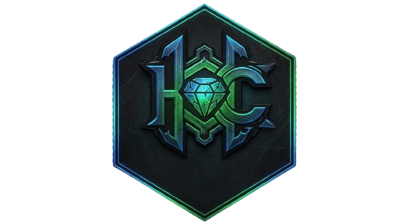

#  Hereisa Client

A professional-grade, high-performance utility client for **Minecraft 1.21.11**, built on the **Fabric** mod loader. Designed with a dark, industrial aesthetic and a focus on modularity, speed, and efficiency.

---

### ✨ Features
**Hereisa** is packed with a wide range of modules, designed to bypass modern server-side checks while maintaining a "Premium" user experience.

| Category | Highlights |
| :--- | :--- |
| **Combat** | KillAura, CrystalAura, Reach, Auto-Clicker, Velocity, TriggerBot |
| **Movement** | Boat Fly, Spider, Step, Scaffold, Jesus, NoSlow, ElytraFly |
| **Render** | X-Ray, ESP (Player/Storage), Tracers, FullBright, Search, Breadcrumbs |
| **Player** | Auto-Eat, Chest Stealer, Inventory Manager, Auto-Tool, MiddleClickFriend |
| **World** | Nuker, Build-Assistant, Fast-Place, Timer, PacketMine |

---

### 🚀 Getting Started

To get started with **Hereisa**, ensure you have the correct Minecraft environment set up.

1.  **Fabric Loader:** Download and install the [Fabric Loader](https://fabricmc.net/use/) for Minecraft **1.21.11**.
2.  **Download:** Grab the latest `.jar` from the [Releases](https://github.com/mrshivada/hereisa-client/releases) section.
3.  **Install:** Move the downloaded file into your `.minecraft/mods` folder.
4.  **Launch:** Start the game using the Fabric profile and press **`RIGHT SHIFT`** to open the ClickGUI.

---

### 🛠️ Development & Building

Hereisa is open-source and built using **Java 21**. We welcome contributions from the developer community.

#### Prerequisites
* **JDK 21** or higher.
* Knowledge of the **Fabric API** and **SpongePowered Mixins**.

#### Build from Source
```bash```
git clone [https://github.com/Hereisa-Development/hereisa-client.git](https://github.com/Hereisa-Development/hereisa-client.git)
cd hereisa-client
./gradlew build

The compiled build will be located in build/libs/.

🎨 Visuals & UI
The interface of Hereisa is inspired by high-end industrial software. It features a Dark/Metallic theme with high-contrast accents, ensuring maximum visibility and a sleek look.

Custom ClickGUI: Fully draggable and pinnable windows with smooth animations.

Highly Configurable: Every module features a deep set of settings (Range, Speed, Mode, etc.).

HUD: A sleek on-screen display showing active modules, FPS, and TPS.

🛡️ Safety & Disclaimer
Hereisa Client is an educational tool for understanding game engine manipulation and Java bytecode.

Warning: Using this client on public servers (e.g., Hypixel, 2b2t, or local networks) will likely result in a permanent ban. We do not encourage "ruining" others' experiences; use it responsibly on anarchy servers or private testing environments.

🤝 Credits & Inspiration
Lead Developer: Bnshivada

<p align="center">


</p>

Ready to explore the code? [View Source](github.com/Heresia-Development/Hereisa-Client)
